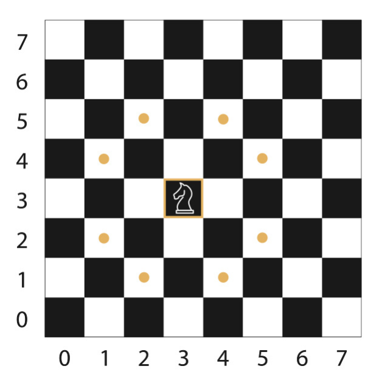

# Knights Travails

After learning about DFS and BFS, I am tasked to solve a problem with a search
algorithm. The premise of the problem is a chess board and a knight piece. The
knight can only move to certain positions from its current position. 

I need to build a function `knightMoves` that shows the shortest possible way to get from one square to another by outputting all squares the knight will stop on 
along the way.

Sometimes there is more than one fastest path. Examples of this are shown below. 
Any answer is correct as long as it follows the rules and gives the shortest 
possible path.

- `knightMoves([0,0],[3,3])` may return `[[0,0],[2,1],[3,3]] or [[0,0],[1,2],[3,3]]`.
- `knightMoves([3,3],[0,0])` may return `[[3,3],[2,1],[0,0]] or [[3,3],[1,2],[0,0]]`.
- `knightMoves([0,0],[7,7])` may return `[[0,0],[2,1],[4,2],[6,3],[4,4],[6,5],[7,7]]` or `[[0,0],[2,1],[4,2],[6,3],[7,5],[5,6],[7,7]]` or other possible shortest paths.